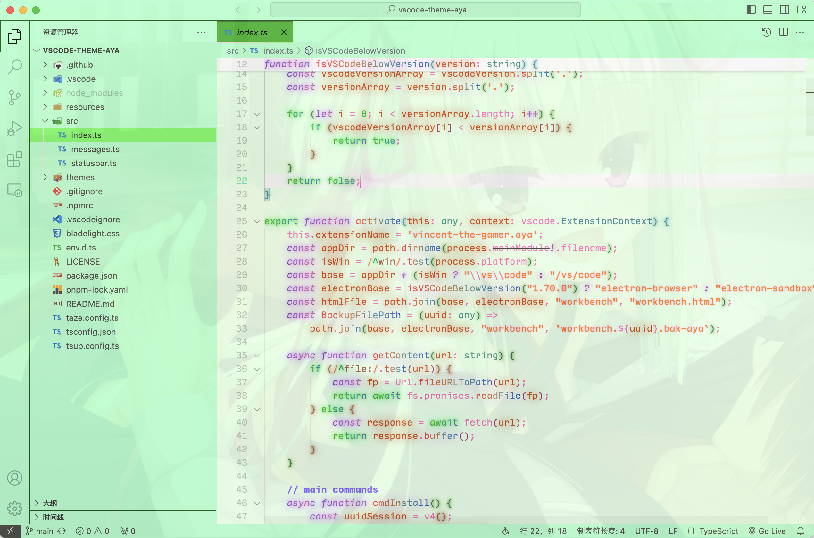

<div align="center" style="padding: 5px;">
    
</div>

<h1 align="center">VSCode Theme Aya</h1>

<p align="center">
    Murasame-style VSCode theme.
</p>

<p align="center">
    <b>
        <i>
            Aya is always with you. （づ￣3￣）づ╭❤～
        </i>
    </b>
</p>

<p align="center">
<a href="https://marketplace.visualstudio.com/items?itemName=vincent-the-gamer.aya" target="__blank"></a>
</p>


## Description
[Aya(綾)](https://senren.nekonyansoft.com/chara.html) is one of the main characters in game [「Senren * Banka」](https://store.steampowered.com/app/1144400/SenrenBanka/).

She is generally called Murasame(ムラサメ) in the game, Aya(綾) is her real name.

## Aya Bladelight
This extension has bundled [Custom CSS and JS Loader](https://github.com/be5invis/vscode-custom-css). So you can simply get the glow effect and new startup logo showed in preview, just follow these steps:

1. Setup the path to `bladelight.css` in `settings.json`.

> [!WARNING]
> `file://` is required!!!!

macOS:

```json
"aya.imports": [
    "file:///Users/{USER_NAME}/.vscode/extensions/vincent-the-gamer.aya-{plugin-version}/bladelight.css"
],
```

Windows: 
```json
"aya.imports": [
    "file://C:/Users/{USER_NAME}/.vscode/extensions/vincent-the-gamer.aya-{plugin-version}/bladelight.css"
],
```

Linux:

```json
"aya.imports": [
    "file:///home/{USER_NAME}/.vscode/extensions/vincent-the-gamer.aya-{plugin-version}/bladelight.css"
],
```

2. Run `Enable Aya Bladelight`.
- `Ctrl + Shift + P` or `Command + Shift + P`
- Input `enable aya bladelight`
- P.S. Disable it by running `Disable Aya Bladelight`

And happy hacking~~~ ☆´∀｀☆

## Add a background image
Please use [Background](https://github.com/shalldie/vscode-background) extension.

Download pic from the top of this document, then add these codes to `settings.json`.
```json
"background.fullscreen": {
    "images": ["file:///path/to/your/pic"],
    "opacity": 0.91,
    "size": "cover",
    "position": "center",
    "interval": 0
},
"background.editor": {
    "background-position": "100% 100%",
    "background-size": "cover",
    "opacity": 0.18
},
```

Additionally, avoid your comment color to be green-like.
```json
"editor.tokenColorCustomizations": {
    "comments": {
        "foreground": "#856cff",
        "fontStyle": "bold"
    }
},
```

Then your Code will look like my preview pic.

## Preview
Enable Aya Bladelight to get the glow effect and custom logo.




## License

[MIT](./LICENSE) License © 2024 [Vincent-the-gamer](https://github.com/Vincent-the-gamer)
