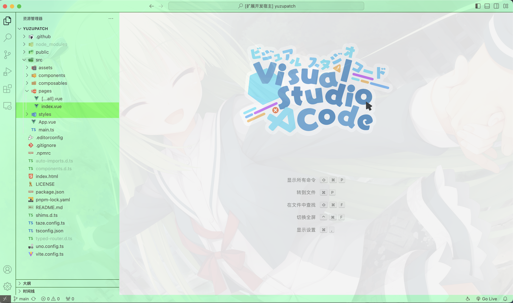

    

<h1 align="center">VSCode Theme Aya</h1>

    <b>
        <i>
            Aya is always with you. （づ￣3￣）づ╭❤～
        </i>
    </b>

## Note
Work in progress.

## Add a background image
Please use [Background](https://github.com/shalldie/vscode-background) extension.

## Early Preview

## License

[MIT](./LICENSE) License © 2024 [Vincent-the-gamer](https://github.com/Vincent-the-gamer)